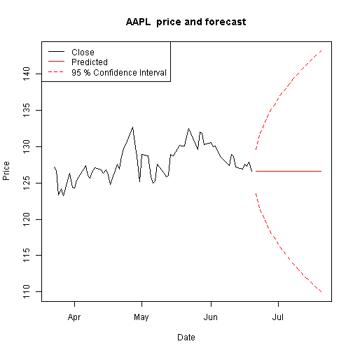

## Stock Graphing and Forecasting 

1. Shiny App
2. Automatically pulls live data from Yahoo Finance
3. Graphs stock price and provides a prediction with confidence intervals
4. Selectable date ranges and forecast windows
5. Pick your desired confidence interval

--- .class #id 

## Demo

For example, suppose you want to decide if you sould invest your retirement funds in Apple stock.

1. You think the past 90 days are a good indicator of momentum in the next month
2. You want to be 95% confident in your forecast


```r
ticker <- "AAPL"
startDate <- Sys.Date() - 90
endDate <- Sys.Date()
data <- getSymbols (ticker, src = "yahoo", auto.assign = FALSE)
attr (data, "dimnames")[[2]] <- c ("Open", "High", "Low", "Close", "Volume", "Adjusted")
stock <- data [ (startDate <= index (data)) & (index (data) <= endDate) ]
forecastDays <- 30
confidence <- 95
```

--- .class #id 

## Sample Output

 

* Disclaimer: don't really trade on based on this forecast.

--- .class #id 

## Thank you!

Resources:

1. The app site: https://hormel.shinyapps.io/stock_forecaster

    Try it yourself!

2. GitHub repository: https://github.com/hormel/developingdataproducts

    Contains the Shiny code


